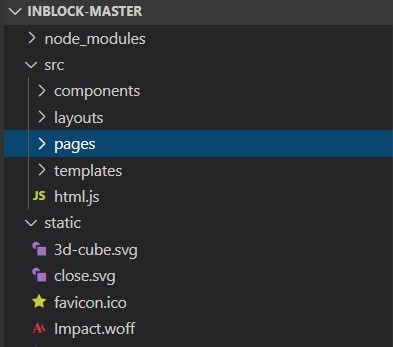
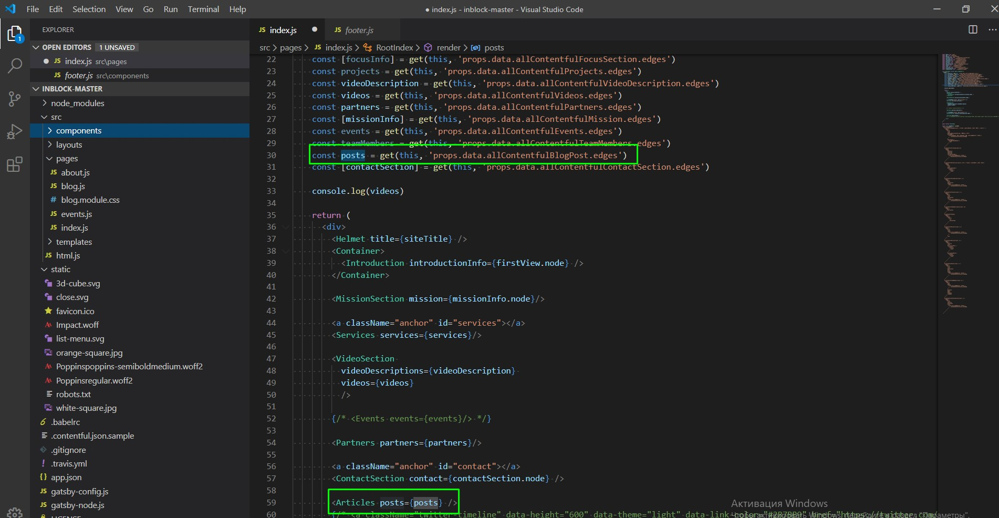

# inblock.io - Website Documentation

## Tutorials and docs to reference:
- [Contentful](https://www.contentful.com/developers/docs/tutorials/)
- [Netlify](https://docs.netlify.com/)
- [GatsbyJS ](https://www.gatsbyjs.org/tutorial/)
- [GraphQL](https://graphql.org/learn/)

## Tools that you can use:
- [Visual Studio Code](https://code.visualstudio.com/download)
- [Git Bash](https://git-scm.com/downloads)

## Site structure: 
1. Home page
2. About
3. Blog
4. Templates for subpages: 
    - news
    - services
    - footer static pages(privacy police, legal)

## App files structure:


src:
- component – reusable component
- pages – independent static pages,
- templates – templates for multiple dynamic pages(posts, events, services …)

## Running project locally:
### Notice: To run the app on local machine [Node.js](https://nodejs.org/en/) should be installed(current version npm 5.7.1)
1. Pull project from github
2. Open console and run command __npm install__
3. From file .contentful.json.sample create .contentful.json, put there right spaceId and accessToken (Content Delivery API - access token in API keys -> Example Key 1)
4. In console run command __npm run dev__
5. Edit as needed, autoreload takes care of the rest.

## Workflow for editing a component:
1. Find component or page that you want to edit.
__If you need hide some element:__
2. Delete or comment(recommend) part of html that you want to hide. 
__If you want add new field of some content model to show:__
2. Add that field to GraphQL query and check if you receive it from contentful(can be checked on http://localhost:8000/___graphql in dev run). 

__Example:__
```javascript
query HomeQuery {
  allContentfulBlogPost(sort: { fields: [publishDate], order: DESC }, limit:4 ) {
    edges {
      node {
        title
        slug
        publishDate(formatString: "MMMM Do, YYYY")
      }
    }
  }
}
```

3. Add it in the right place on page.

## Workflow for creating new component:
1. Create Content model on [contentful.com](https://www.contentful.com)
2. Fill data for content model.
3. Create GraphQL query to get data of new model (can be checked on http://localhost:8000/___graphql in dev run)

__Example:__
```javascript
query HomeQuery {
  allContentfulBlogPost(sort: { fields: [publishDate], order: DESC }, limit:4 ) {
    edges {
      node {
        title
        slug
        publishDate(formatString: "MMMM Do, YYYY")
      }
    }
  }
}
```
4. Pass to right component like a props or just put in right place on page.


## Workflow of creating new dynamic page:
1. Create Content model on [contentful.com](https://www.contentful.com)
2. Fill some date for content model.
3. Create CraphQL query to get data of new model (can be checked on http://localhost:8000/___graphql in dev run)
4. Create template for future dynamic page in folder /templates
5. Add GraphQL query to to gatsby-node.js and make resolver that will create dynamic pages

__Example:__
```javascript
  const services = result.data.allContentfulOurServices.edges
    services.forEach((service, index) => {
      createPage({
        path: `/services/${service.node.slug}/`,
        component: serviceTemplate,
        context: {
          slug: service.node.slug
        },
      })
    })
```

## Workflow of modifying existing page:
1. DO NOT TOUCH CONTENT. It will break any build that depends on pulling content form contentful.
2.
